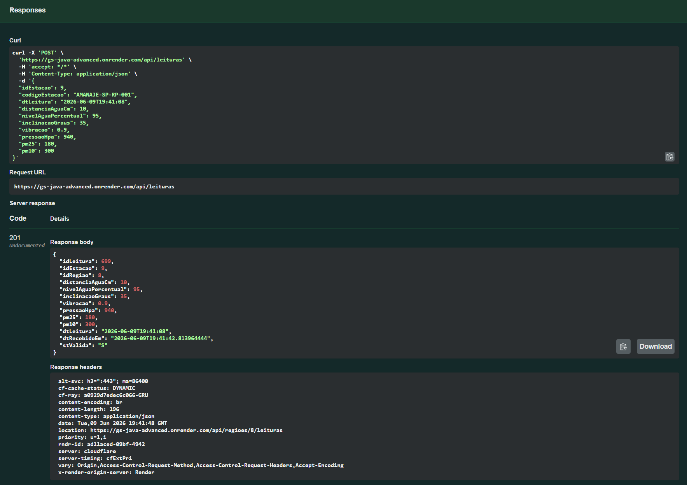
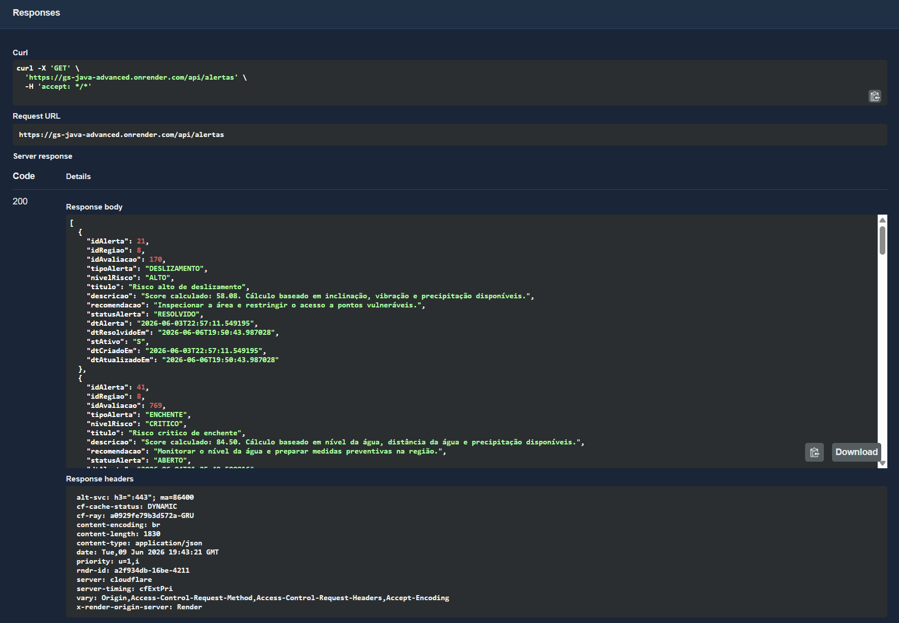

# Amanajé API

API REST desenvolvida para a **Global Solution FIAP 2026/1**.

O **Amanajé** é uma solução de monitoramento climático e ambiental voltada para regiões vulneráveis. A proposta é apoiar governos, Defesa Civil, ONGs e instituições no acompanhamento preventivo de riscos ambientais, combinando telemetria IoT, dados climáticos externos, avaliação de risco, alertas e indicadores regionais.

---

## Integrantes

| Integrante | Responsabilidades principais                                                                |
| ---------- | ------------------------------------------------------------------------------------------- |
| Gustavo    | Java Advanced; DevOps Tools & Cloud Computing                                               |
| Lucca      | Mastering Relational and Non-Relational Database; Mobile Application Development            |
| Rafaela    | Compliance, Quality Assurance & Tests; TOGAF/ArchiMate                                      |
| Sabelli    | Advanced Business Development with .NET; Disruptive Architectures: IoT, IoB & Generative IA |

---

## Objetivo do projeto

O Amanajé busca resolver o problema da baixa cobertura de monitoramento climático e ambiental em áreas vulneráveis, como comunidades, regiões ribeirinhas, encostas, áreas urbanas sensíveis e pontos sujeitos a enchentes, deslizamentos, tempestades e problemas de qualidade do ar.

A aplicação propõe um núcleo funcional para organizar:

* cadastro de clientes institucionais;
* cadastro de usuários vinculados a clientes;
* cadastro de regiões monitoradas;
* cadastro de estações IoT reais, simuladas ou de referência;
* recebimento de telemetria IoT por HTTP e MQTT;
* integração com dados climáticos externos produzidos pelo serviço .NET/C#;
* cálculo de avaliações de risco ambiental;
* geração e resolução de alertas;
* indicadores regionais;
* dashboard operacional para frontend e aplicativo mobile;
* comunicação preventiva com ESP32/Wokwi via HiveMQ.

---

## Tecnologias utilizadas

* Java 17
* Spring Boot 3.5.14
* Spring Web
* Spring Data JPA
* Bean Validation
* Oracle Database
* Swagger/OpenAPI com Springdoc
* Maven
* Lombok
* Spring HATEOAS
* Spring Boot DevTools
* Eclipse Paho MQTT Client
* Docker
* Render

---

## Estrutura do projeto

```text
src/main/java/br/com/fiap/amanaje
├── alertas
├── clientes
├── common
│   ├── config
│   ├── exception
│   ├── model
│   ├── processamento
│   └── response
├── dashboard
├── estacoes
├── indicadores
├── leituras
│   └── mqtt
├── observacoes
├── regioes
├── riscos
├── usuarios
└── AmanajeApiApplication.java
```

---

## Documentação da entrega

Os principais documentos da entrega Java Advanced estão disponíveis na pasta `docs/`:

| Documento                                                         | Descrição                                                                                                                   |
| ----------------------------------------------------------------- | --------------------------------------------------------------------------------------------------------------------------- |
| [Arquitetura da Solução](docs/arquitetura.md)                     | Explica a arquitetura da API, camadas, módulos, integrações, fluxo IoT, Oracle, Swagger e Render.                           |
| [Modelagem Avançada Java](docs/modelagem-avancada-java.md)        | Documenta o uso de `@MappedSuperclass`, `@Embeddable`, múltiplas tabelas e a decisão sobre consistência composta no Oracle. |
| [DDL Oracle Amanajé](docs/database/AMANAJE_boot-setup_DDL_v3.sql) | Script DDL utilizado como fonte de verdade para o schema Oracle do projeto.                                                 |

---

### Camadas principais

| Camada       | Função                                                                   |
| ------------ | ------------------------------------------------------------------------ |
| `controller` | Expõe os endpoints REST da API                                           |
| `service`    | Contém regras de negócio, validações, cálculo de risco e orquestração    |
| `repository` | Faz a comunicação com o banco via Spring Data JPA                        |
| `model`      | Mapeia as tabelas Oracle com JPA                                         |
| `dto`        | Objetos de entrada e saída das requisições                               |
| `mqtt`       | Contém subscriber, publisher e payloads para integração com HiveMQ/Wokwi |
| `exception`  | Tratamento centralizado de erros                                         |
| `config`     | Configurações da aplicação, CORS, Swagger/OpenAPI e propriedades         |

---

## Perfis da aplicação

A aplicação possui dois modos principais de execução.

### Perfil `local`

Modo utilizado para iniciar a aplicação localmente conectada ao Oracle FIAP, usando as configurações do arquivo principal da aplicação.

```powershell
.\mvnw.cmd spring-boot:run
```

Endpoint para teste:

```http
GET http://localhost:8080/api/health
```

Resposta esperada:

```json
{
  "application": "Amanajé API",
  "status": "UP",
  "message": "API principal do Amanajé em execução"
}
```

### Perfil `render`

Modo utilizado para executar a aplicação publicada em ambiente externo no Render.

A aplicação utiliza variáveis de ambiente para banco Oracle, CORS, porta HTTP e integração MQTT.

Neste projeto acadêmico, as credenciais Oracle podem ser configuradas diretamente no ambiente de execução para facilitar a validação pelo professor.

A aplicação utiliza:

```properties
spring.jpa.hibernate.ddl-auto=validate
```

Isso significa que o Hibernate **valida** o schema existente, mas não cria, altera ou remove tabelas automaticamente.

---

## Build do projeto

Para compilar o projeto e executar os testes:

```powershell
.\mvnw.cmd clean package
```

---

## Executando a aplicação

### Localmente

```powershell
.\mvnw.cmd spring-boot:run
```

### Com MQTT habilitado

```powershell
$env:MQTT_ENABLED="true"
$env:MQTT_BROKER_URL="tcp://mqtt-dashboard.com:1883"
$env:MQTT_TELEMETRY_TOPIC="app/estacoes/+/telemetria"
$env:MQTT_STATUS_TOPIC="app/estacoes/+/status"
$env:MQTT_COMMAND_TOPIC_PATTERN="app/estacoes/%s/alertas"
$env:MQTT_EVALUATE_RISK="true"

.\mvnw.cmd spring-boot:run
```

Após iniciar a aplicação, acesse:

```text
http://localhost:8080/api/health
```

---

## Swagger / OpenAPI

Com a aplicação em execução localmente, a documentação Swagger pode ser acessada em:

```text
http://localhost:8080/swagger-ui/index.html
```

Link do deploy no Render pode ser acessada em:

```text
https://gs-java-advanced.onrender.com/swagger-ui/index.html
```

Link da apresentação:

```text
https://gs-java-advanced.onrender.com/swagger-ui/index.html
```

Link do pitch:

```text
https://gs-java-advanced.onrender.com/swagger-ui/index.html
```

---

## Principais módulos da API

### 1. Cadastros básicos

Recursos principais:

```http
/api/clientes
/api/usuarios
/api/regioes
/api/estacoes
```

Esses endpoints permitem cadastrar e consultar os dados estruturais da aplicação.

---

### 2. Monitoramento IoT e status de estação

```http
/api/leituras
/api/regioes/{id}/leituras
```

Permite registrar leituras IoT enviadas por estações reais, simuladas ou de referência.

A API também possui integração MQTT com HiveMQ/Wokwi.

Tópicos utilizados:

```text
app/estacoes/{stationCode}/telemetria
app/estacoes/{stationCode}/status
app/estacoes/{stationCode}/alertas
```

Fluxo MQTT:

* ESP32/Wokwi publica telemetria no HiveMQ;
* Java consome a mensagem;
* Java identifica a estação por `stationCode`;
* Java salva a leitura no Oracle;
* Java calcula o risco ambiental;
* Java publica um comando preventivo de volta para o ESP32;
* ESP32 controla LED verde, LED vermelho, buzzer e tela OLED.

---

### 3. Dados climáticos externos

```http
/api/observacoes-climaticas
/api/regioes/{id}/observacoes-climaticas/ultima
```

Permite registrar e consultar observações climáticas externas associadas a regiões monitoradas.

Esses dados são produzidos pelo serviço .NET/C#, responsável por coletar informações de fontes externas como Open-Meteo.

---

### 4. Riscos e alertas preventivos

```http
/api/riscos
/api/alertas
```

A API calcula riscos ambientais a partir de leituras IoT e observações climáticas externas.

Categorias avaliadas:

* `ENCHENTE`
* `DESLIZAMENTO`
* `TEMPESTADE`
* `QUALIDADE_AR`

Níveis de risco:

* `BAIXO`
* `MODERADO`
* `ALTO`
* `CRITICO`

Alertas são gerados automaticamente para riscos `ALTO` e `CRITICO`.

---

### 5. Dashboard, indicadores e histórico operacional

```http
/api/dashboard/summary
/api/indicadores-regionais
```

Esses endpoints fornecem dados consolidados para consumo do frontend e do aplicativo mobile.

A API também possui tabelas de apoio para histórico de eventos, processamento, logs técnicos e status de estações.

---

## Recursos técnicos implementados

A API implementa os principais requisitos técnicos da disciplina de Java Advanced:

* API REST com Spring Boot;
* entidades JPA mapeadas para Oracle;
* múltiplas tabelas relacionais;
* DTOs implementados com Java Records;
* Bean Validation;
* tratamento centralizado de exceções;
* filtros por parâmetros;
* HATEOAS em endpoints selecionados;
* documentação Swagger/OpenAPI;
* integração com Oracle;
* validação do schema com `ddl-auto=validate`;
* CORS configurado;
* deploy público no Render;
* Dockerfile com build multi-stage;
* integração MQTT com HiveMQ/Wokwi;
* subscriber para telemetria IoT;
* subscriber para status de hardware;
* publisher de comandos/alertas para ESP32;
* cálculo de risco ambiental;
* geração e resolução de alertas.

---

## Paginação e ordenação

Os endpoints de listagem do MVP priorizam filtros por parâmetros, sem paginação obrigatória nesta versão.

Exemplos:

```http
GET /api/usuarios?idCliente=1
GET /api/regioes?idCliente=1
GET /api/regioes?estado=SP
GET /api/alertas?status=ABERTO
GET /api/alertas?nivel=CRITICO
GET /api/indicadores-regionais?estado=SP
```

---

## Fluxo recomendado de teste

Para validar o fluxo principal da API, recomenda-se executar as operações nesta ordem:

1. Criar um cliente.
2. Criar um usuário vinculado ao cliente.
3. Criar uma região monitorada vinculada ao cliente.
4. Criar uma estação IoT vinculada à região.
5. Enviar uma leitura IoT por HTTP ou MQTT.
6. Registrar uma observação climática externa para a região.
7. Executar a avaliação de risco da região.
8. Consultar o risco atual da região.
9. Consultar os alertas gerados.
10. Resolver um alerta.
11. Consultar o resumo do dashboard.
12. Consultar indicadores regionais.
13. Publicar telemetria no HiveMQ pelo ESP32/Wokwi.
14. Verificar o comando preventivo retornado pelo Java no tópico de alertas.
15. Confirmar acionamento de LED vermelho, buzzer e OLED no Wokwi.
16. Consultar no Oracle as leituras, avaliações e alertas persistidos.
17. Validar os endpoints pelo Swagger público.
18. Validar o consumo dos dados pelo aplicativo mobile.

---

## Exemplos de rotas por recurso

A maioria dos recursos segue o padrão REST abaixo:

```http
POST   /api/recurso
GET    /api/recurso
GET    /api/recurso/{id}
PUT    /api/recurso/{id}
DELETE /api/recurso/{id}
```

---

## Evidências dos endpoints de regiões

<details>
  <summary><strong>POST /api/regioes</strong></summary>

  <p align="center">
    
  </p>
</details>

<details>
  <summary><strong>GET /api/regioes</strong></summary>

  <p align="center">
    
  </p>
</details>

<details>
  <summary><strong>PUT /api/regioes/{id}</strong></summary>

  <p align="center">
    
  </p>
</details>

<details>
  <summary><strong>DELETE /api/regioes/{id}</strong></summary>

  <p align="center">
    
  </p>
</details>

### Evidências dos endpoints de leituras IoT

<details>
  <summary><strong>POST /api/leituras</strong></summary>

  <p align="center">
    
  </p>
</details>

<details>
  <summary><strong>GET /api/regioes/{id}/leituras</strong></summary>

  <p align="center">
    
  </p>
</details>

### Evidências dos endpoints de alertas

<details>
  <summary><strong>GET /api/alertas</strong></summary>

  <p align="center">
    
  </p>
</details>

<details>
  <summary><strong>PUT /api/alertas/{id}/resolver</strong></summary>

  <p align="center">
    
  </p>
</details>

---
