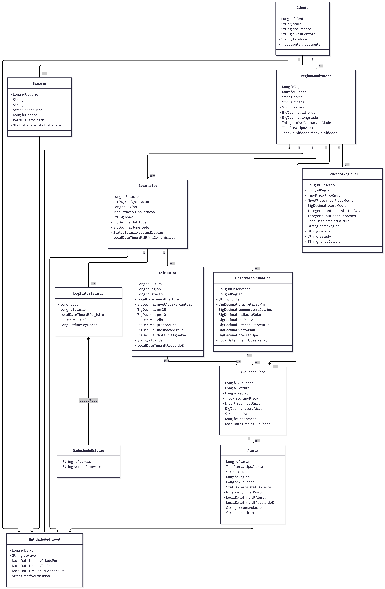

# Amanajé API

API REST desenvolvida para a **Global Solution FIAP 2026/1**.

O **Amanajé** é uma solução de monitoramento climático e ambiental local voltada para áreas vulneráveis. A proposta é apoiar governos, Defesa Civil, ONGs e instituições na instalação, simulação e operação de estações IoT, combinando dados locais de sensores com observações climáticas externas para gerar avaliações de risco, alertas e indicadores regionais.

---

## Integrantes

| Integrante | Responsabilidades principais                                                     |
| ---------- | -------------------------------------------------------------------------------- |
| Gustavo    | Java Advanced; DevOps Tools & Cloud Computing                                    |
| Lucca      | Mastering Relational and Non-Relational Database; Mobile Application Development |
| Rafaela    | Compliance, Quality Assurance & Tests; TOGAF/ArchiMate                           |
| Sabelli    | Advanced Business Development with .NET; IoT/Wokwi                               |

---

## Objetivo do projeto

O Amanajé busca resolver o problema da baixa cobertura de monitoramento climático e ambiental em regiões vulneráveis, rurais, periféricas, ribeirinhas ou sujeitas a desastres ambientais.

A aplicação propõe um núcleo funcional para organizar:

* cadastro de clientes institucionais;
* cadastro de usuários vinculados a clientes;
* cadastro de regiões monitoradas;
* cadastro de estações IoT reais, simuladas ou de referência;
* recebimento de leituras IoT por HTTP;
* persistência de observações climáticas externas produzidas pelo serviço .NET/C#;
* cálculo de avaliações de risco ambiental;
* geração e resolução de alertas;
* consulta de indicadores regionais;
* resumo operacional para dashboard.

No MVP, os tipos de cliente implementados são:

* Governo / Defesa Civil;
* ONG.

Outros tipos de cliente, como fazenda privada, cooperativa e pesquisa/universidade, permanecem preparados no modelo, mas não dirigem complexidade funcional no backend desta versão.

---

## Tecnologias utilizadas

* Java 17
* Spring Boot 3.5.14
* Spring Web
* Spring Data JPA
* JpaRepository
* Bean Validation / Spring Validation
* Lombok
* Spring Boot DevTools
* Spring HATEOAS
* Swagger/OpenAPI com Springdoc
* Eclipse Paho MQTT Client
* Oracle Database
* Maven
* Docker e ambiente em nuvem serão tratados na etapa de DevOps

---

## Estrutura do projeto

```text
src/main/java/br/com/fiap/amanaje
├── alertas
│   ├── controller
│   ├── dto
│   ├── enums
│   ├── model
│   ├── repository
│   └── service
├── clientes
│   ├── controller
│   ├── dto
│   ├── enums
│   ├── model
│   ├── repository
│   └── service
├── common
│   ├── auditoria
│   ├── config
│   ├── exception
│   ├── log
│   ├── model
│   ├── processamento
│   └── response
├── dashboard
│   ├── controller
│   ├── dto
│   └── service
├── estacoes
│   ├── controller
│   ├── dto
│   ├── enums
│   ├── model
│   ├── repository
│   └── service
├── indicadores
│   ├── controller
│   ├── dto
│   ├── model
│   ├── repository
│   └── service
├── leituras
│   ├── controller
│   ├── dto
│   ├── mqtt
│   ├── model
│   ├── repository
│   └── service
├── observacoes
│   ├── controller
│   ├── dto
│   ├── model
│   ├── repository
│   └── service
├── regioes
│   ├── controller
│   ├── dto
│   ├── enums
│   ├── model
│   ├── repository
│   └── service
├── riscos
│   ├── controller
│   ├── dto
│   ├── enums
│   ├── model
│   ├── repository
│   └── service
├── usuarios
│   ├── controller
│   ├── dto
│   ├── enums
│   ├── model
│   ├── repository
│   └── service
└── AmanajeApiApplication.java
```

---

## Arquitetura

<p align="center">
  
</p>

---

## Camadas principais

| Camada       | Função                                                                     |
| ------------ | -------------------------------------------------------------------------- |
| `controller` | Expõe os endpoints REST da API                                             |
| `service`    | Contém regras de negócio, validações e orquestração                        |
| `repository` | Faz a comunicação com o banco via Spring Data JPA                          |
| `model`      | Mapeia as tabelas Oracle com JPA e agrupa modelos compartilhados           |
| `dto`        | Records de entrada e saída das requisições                                 |
| `enums`      | Enumerações de domínio                                                     |
| `exception`  | Tratamento centralizado de erros                                           |
| `config`     | Configurações da aplicação, CORS e Swagger/OpenAPI                         |

---

## Banco de dados Oracle

A aplicação utiliza Oracle Database como banco relacional.

O schema é criado a partir do DDL:

```text
docs/database/AMANAJE_boot-setup_DDL_v3.sql
```

A API utiliza:

```yaml
spring:
  jpa:
    hibernate:
      ddl-auto: validate
```

O Hibernate valida o schema existente, mas não cria, altera ou remove tabelas automaticamente.


---

## Configuração Oracle

A configuração fica em:

```text
src/main/resources/application.yml
```

A aplicação está configurada para conectar ao Oracle FIAP usando valores padrão acadêmicos no próprio `application.yml`, mantendo também suporte a sobrescrita por variáveis de ambiente.

```text
SERVER_PORT
DB_URL
DB_USERNAME
DB_PASSWORD
```

Exemplo em PowerShell, caso seja necessário sobrescrever a conexão:

```powershell
$env:DB_URL="jdbc:oracle:thin:@oracle.fiap.com.br:1521:ORCL"
$env:DB_USERNAME="SEU_USUARIO"
$env:DB_PASSWORD="SUA_SENHA"
$env:SERVER_PORT="8080"
.\mvnw.cmd spring-boot:run
```

---

## Build do projeto

Para compilar o projeto e executar os testes:

```powershell
.\mvnw.cmd clean test
```

Também é possível gerar o pacote da aplicação:

```powershell
.\mvnw.cmd clean package
```

---

## Executando a aplicação

Para iniciar a API:

```powershell
.\mvnw.cmd spring-boot:run
```

Após iniciar a aplicação, acesse:

```text
http://localhost:8080/api/health
```

Resposta esperada:

```json
{
  "application": "Amanajé API",
  "status": "UP",
  "message": "API principal do Amanajé em execução"
}
```

---

## Deploy no Render

Para publicar a API no Render, configure o serviço como **Web Service** com **Language: Docker**.

Configurações principais:

```text
Language: Docker
Root Directory: vazio
Dockerfile Path: ./Dockerfile
```

O Dockerfile fica na raiz do repositório, compila a aplicação com o Maven Wrapper e executa o jar gerado:

```bash
./mvnw clean package -DskipTests
java -jar app.jar
```

Variáveis de ambiente obrigatórias no Render:

```text
DB_URL
DB_USERNAME
DB_PASSWORD
```

Variáveis de ambiente opcionais para MQTT no Render:

```text
MQTT_ENABLED
MQTT_BROKER_URL
MQTT_CLIENT_ID
MQTT_USERNAME
MQTT_PASSWORD
MQTT_TELEMETRY_TOPIC
MQTT_STATUS_TOPIC
MQTT_COMMAND_TOPIC_PATTERN
MQTT_EVALUATE_RISK
```

Mantenha `MQTT_ENABLED=false` até confirmar broker, credenciais e tópicos. Depois da confirmação, habilite o MQTT no Render apenas por variáveis de ambiente, sem credenciais fixas no código.

O Render fornece a variável `PORT` automaticamente. A aplicação lê `PORT` antes de `SERVER_PORT`, mantendo `SERVER_PORT` e `8080` como fallbacks para execução local.

O DDL Oracle precisa estar aplicado previamente no banco, pois a API mantém `spring.jpa.hibernate.ddl-auto: validate` e apenas valida o schema existente.

Se a aplicação falhar no Render com erro de banco ou rede, o Oracle FIAP pode não estar acessível a partir do ambiente em nuvem do Render.

---

## Swagger / OpenAPI

Com a aplicação em execução, a documentação Swagger pode ser acessada em:

```text
http://localhost:8080/swagger-ui/index.html
```

A especificação OpenAPI em JSON pode ser acessada em:

```text
http://localhost:8080/v3/api-docs
```

---

## Principais módulos da API

### 1. Clientes

```http
/api/clientes
```

Permite cadastrar e consultar clientes institucionais do Amanajé.

Principais operações:

```http
POST   /api/clientes
GET    /api/clientes
GET    /api/clientes/{id}
PUT    /api/clientes/{id}
DELETE /api/clientes/{id}
```

O `DELETE` realiza exclusão lógica, marcando o registro como inativo.

---

### 2. Usuários

```http
/api/usuarios
```

Permite cadastrar e consultar usuários vinculados a um cliente.

Principais operações:

```http
POST   /api/usuarios
GET    /api/usuarios
GET    /api/usuarios/{id}
PUT    /api/usuarios/{id}
DELETE /api/usuarios/{id}
```

O endpoint `GET /api/usuarios` aceita filtro opcional por cliente:

```http
GET /api/usuarios?idCliente=1
```

A API não implementa login, autenticação ou JWT nesta versão. O cadastro de usuários existe para representar o vínculo institucional previsto no MVP.

---

### 3. Regiões monitoradas

```http
/api/regioes
```

Permite cadastrar regiões monitoradas vinculadas a clientes.

Principais operações:

```http
POST   /api/regioes
GET    /api/regioes
GET    /api/regioes/{id}
PUT    /api/regioes/{id}
DELETE /api/regioes/{id}
```

O endpoint de listagem aceita filtros como:

```http
GET /api/regioes?idCliente=1
GET /api/regioes?estado=SP
GET /api/regioes?cidade=Ribeirão Preto
```

O `DELETE` realiza exclusão lógica.

---

### 4. Estações IoT

```http
/api/estacoes
```

Permite cadastrar estações IoT reais, simuladas ou de referência.

Principais operações:

```http
POST   /api/estacoes
GET    /api/estacoes/{id}
PUT    /api/estacoes/{id}
DELETE /api/estacoes/{id}
GET    /api/estacoes/regiao/{idRegiao}
```

Uma região monitorada pode possuir várias estações IoT. Cada estação pertence a uma única região.

---

### 5. Leituras IoT

```http
/api/leituras
```

Endpoint utilizado para receber leituras de estações IoT, incluindo simulações feitas com ESP32/Wokwi.

Principais operações:

```http
POST /api/leituras
GET  /api/regioes/{id}/leituras
```

A leitura pode ser enviada identificando a estação por `idEstacao` ou por `codigoEstacao`.

Exemplo de payload:

```json
{
  "codigoEstacao": "AMANAJE-SP-RP-001",
  "dtLeitura": "2026-06-02T14:30:00",
  "distanciaAguaCm": 80,
  "nivelAguaPercentual": 73,
  "inclinacaoGraus": 18.5,
  "vibracao": 0.72,
  "pressaoHpa": 998.4,
  "pm25": 118,
  "pm10": 180
}
```

O endpoint HTTP `POST /api/leituras` permanece disponível para Swagger, frontend, mobile e testes manuais mesmo quando a integração MQTT estiver habilitada.

---

#### Integração MQTT com HiveMQ/Wokwi

O fluxo MQTT permite usar uma estação ESP32 simulada no Wokwi publicando telemetria e status no broker MQTT, sem substituir os endpoints HTTP existentes:

```text
Wokwi/ESP32 → MQTT broker → Java subscriber → Oracle/risco/alerta → Java publisher → MQTT broker → ESP32 outputs
```

O MQTT é opcional e vem desabilitado por padrão. Com `MQTT_ENABLED=false`, a aplicação inicia normalmente e nenhuma conexão com broker é tentada.

Broker usado pelo Java e pelo ESP32:

```text
tcp://mqtt-dashboard.com:1883
```

Para habilitar localmente:

```powershell
$env:MQTT_ENABLED="true"
$env:MQTT_BROKER_URL="tcp://mqtt-dashboard.com:1883"
$env:MQTT_TELEMETRY_TOPIC="app/estacoes/+/telemetria"
$env:MQTT_STATUS_TOPIC="app/estacoes/+/status"
$env:MQTT_COMMAND_TOPIC_PATTERN="app/estacoes/%s/alertas"
$env:MQTT_EVALUATE_RISK="true"
.\mvnw.cmd spring-boot:run
```

Tópico de telemetria:

```text
app/estacoes/{stationCode}/telemetria
```

Tópico de status de hardware:

```text
app/estacoes/{stationCode}/status
```

Tópico de comando/alerta:

```text
app/estacoes/{stationCode}/alertas
```

Exemplo de telemetria recebida:

```json
{
  "stationCode": "APP-ST-001",
  "timestamp": "2026-06-03T18:36:35",
  "waterDistanceCm": 399.94,
  "waterLevelPercent": 0,
  "tiltAngle": 0.00,
  "vibration": 0.00,
  "pressureHpa": 1013.27,
  "pm25": 0.00,
  "pm10": 0.00
}
```

Exemplo de status de hardware recebido:

```json
{
  "stationCode": "APP-ST-001",
  "mac": "24:0A:C4:00:01:10",
  "uptimeSeg": 24,
  "rssi": -94,
  "ip": "10.13.37.2",
  "versaoFirmware": "1.4.0"
}
```

O status persiste os campos compatíveis com o schema atual: estação, uptime, RSSI, IP, versão de firmware e data de registro. O campo `mac` é recebido e logado, mas não é persistido porque não há coluna correspondente no DDL atual.

Exemplo de comando/alerta publicado:

```json
{
  "stationCode": "APP-ST-001",
  "nivelRisco": "CRITICO",
  "tipoRiscoPrincipal": "ENCHENTE",
  "score": 88,
  "alerta": true,
  "ledVerde": false,
  "ledVermelho": true,
  "buzzer": true,
  "mensagem": "Risco crítico detectado. Acionar alerta preventivo imediatamente.",
  "timestamp": "2026-06-03T18:40:00"
}
```

Quando `MQTT_EVALUATE_RISK=true`, cada leitura MQTT salva no Oracle aciona a avaliação de risco da região. A API reutiliza `LeituraIotService` para persistir a leitura e `RiscoService` para calcular risco e gerar alertas para níveis `ALTO` e `CRITICO`. O endpoint HTTP `POST /api/leituras` continua disponível para Swagger, frontend, mobile e testes manuais.

Saídas do ESP32:

* LED Verde = condição OK;
* LED Vermelho = condição perigosa;
* Buzzer = condição crítica/sirene;
* OLED/Tela = informações de telemetria.

Mapeamento de comandos:

| Nível      | Alerta | LED Verde | LED Vermelho | Buzzer |
| ---------- | ------ | --------- | ------------ | ------ |
| `BAIXO`    | não    | sim       | não          | não    |
| `MODERADO` | não    | sim       | não          | não    |
| `ALTO`     | sim    | não       | sim          | não    |
| `CRITICO`  | sim    | não       | sim          | sim    |

---

### 6. Observações climáticas externas

```http
/api/observacoes-climaticas
```

Endpoint utilizado como ponto de integração com o serviço .NET/C#, responsável por buscar dados climáticos externos e persistir observações normalizadas.

Principais operações:

```http
POST /api/observacoes-climaticas
GET  /api/regioes/{id}/observacoes-climaticas/ultima
```

Exemplo de payload:

```json
{
  "idRegiao": 1,
  "fonte": "Open-Meteo",
  "temperatura": 28.5,
  "umidade": 82,
  "precipitacao": 12.4,
  "vento": 18.2,
  "pressaoHpa": 1004.8,
  "radiacaoSolar": 520,
  "indiceUv": 6.5,
  "dtObservacao": "2026-06-02T14:30:00"
}
```

---

### 7. Avaliação de risco

```http
/api/riscos
```

A API calcula riscos ambientais a partir da última leitura IoT válida e da última observação climática externa da região.

Principais operações:

```http
POST /api/riscos/avaliar/{idRegiao}
GET  /api/regioes/{id}/risco-atual
```

Categorias de risco avaliadas:

* `ENCHENTE`
* `DESLIZAMENTO`
* `TEMPESTADE`
* `QUALIDADE_AR`

Níveis de risco:

| Nível      | Faixa de score |
| ---------- | -------------- |
| `BAIXO`    | 0 a 24         |
| `MODERADO` | 25 a 49        |
| `ALTO`     | 50 a 74        |
| `CRITICO`  | 75 a 100       |

Alertas são gerados automaticamente para riscos `ALTO` e `CRITICO`.

---

### 8. Alertas

```http
/api/alertas
```

Permite listar e resolver alertas gerados pelas avaliações de risco.

Principais operações:

```http
GET /api/alertas
PUT /api/alertas/{id}/resolver
```

Filtros opcionais:

```http
GET /api/alertas?idRegiao=1
GET /api/alertas?status=ABERTO
GET /api/alertas?nivel=CRITICO
```

A resolução de alerta altera o status para `RESOLVIDO` e registra data de resolução.

---

### 9. Dashboard

```http
/api/dashboard/summary
```

Fornece um resumo operacional para consumo do frontend.

Principais operações:

```http
GET /api/dashboard/summary
GET /api/dashboard/summary?idCliente=1
```

O resumo agrega informações como:

* total de clientes ativos;
* total de regiões ativas;
* total de estações ativas;
* total de alertas ativos;
* total de alertas críticos;
* total de leituras válidas;
* total de observações climáticas;
* maior nível de risco atual.

---

### 10. Indicadores regionais

```http
/api/indicadores-regionais
```

Lista indicadores regionais persistidos no banco.

Principais operações:

```http
GET /api/indicadores-regionais
```

Filtros opcionais:

```http
GET /api/indicadores-regionais?estado=SP
GET /api/indicadores-regionais?cidade=Ribeirão Preto
GET /api/indicadores-regionais?tipoRisco=ENCHENTE
GET /api/indicadores-regionais?nivelRiscoMedio=ALTO
```

Os indicadores podem ser populados por DML, PL/SQL, rotinas de banco ou fluxo de aplicação.

---

## Fluxo de teste

Para validar o fluxo principal da API, recomenda-se executar as operações nesta ordem:

1. Criar um cliente.
2. Criar um usuário vinculado ao cliente.
3. Criar uma região monitorada vinculada ao cliente.
4. Criar uma estação IoT vinculada à região.
5. Enviar uma leitura IoT para a estação.
6. Registrar uma observação climática externa para a região.
7. Executar a avaliação de risco da região.
8. Consultar o risco atual da região.
9. Consultar os alertas gerados.
10. Resolver um alerta.
11. Consultar o resumo do dashboard.
12. Consultar indicadores regionais.

---

## Recursos técnicos

A API implementa os principais requisitos técnicos:

* API REST com Spring Boot;
* organização em camadas;
* uso correto de controllers, services e repositories;
* injeção de dependência com Spring;
* entidades JPA mapeadas para Oracle;
* 13 tabelas `TB_AMANAJE_*` mapeadas;
* repositórios com Spring Data JPA e JpaRepository;
* DTOs implementados com Java Records;
* Bean Validation / Spring Validation;
* tratamento centralizado de exceções;
* respostas padronizadas de erro;
* Swagger/OpenAPI;
* CORS configurado;
* Lombok;
* Spring Boot DevTools;
* HATEOAS em endpoints selecionados;
* integração com Oracle FIAP;
* validação do schema com `ddl-auto=validate`;
* testes unitários de services e controller de health.

---

## Links da entrega


| Item                              | Link |
| --------------------------------- | ---- |
| Repositório GitHub                | https://github.com/gs-1-tdspo2/gs-java-advanced |
| Deploy público                    | https://gs-java-advanced.onrender.com |
| Swagger/OpenAPI                   | https://gs-java-advanced.onrender.com/swagger-ui/index.html#/ |
| Vídeo de apresentação Java Advanced | INSERIR_LINK_DO_VIDEO |
| Vídeo Pitch                       | INSERIR_LINK_DO_PITCH |


---
